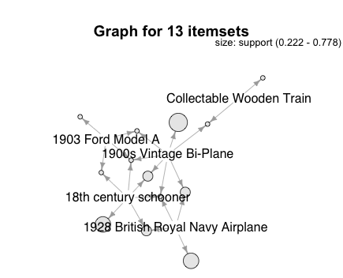
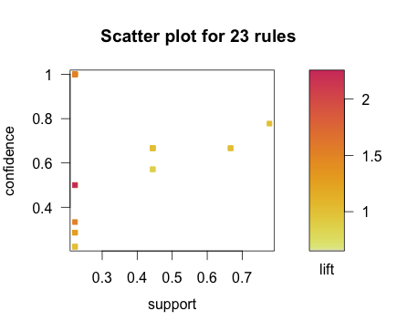

## MarkLogic Server built in algorithms

MarkLogic has built in support for Simple Linear Model, K-means clustering and SVM classification, currently only Simple Linear Model is exposed through the package.

To use Linear Regression
```R
library(rfml)
# connect to source database
mlLocal <- ml.connect()
# Create a ml.data.frame based on iris, you can upload the iris data set using as.ml.data.frame
mlIris <- ml.data.frame(mlLocal, collection = "iris")
# create a linear model
lm <- ml.lm(Sepal.Length~Sepal.Width, mlIris)
# print the model
lm
# ==>
# intercept:  6.52622255089448
# coefficients:  -0.2233610611299
# r-squared : 0.0138226541410807 
```
## rfml added algorithms
The rfml package also implement additional algorithms, still using server side processing. 

### Association rules and Frequent Itemsets
Association rule mining, or Market Basket Analysis, is basically about finding associations or relationships among data items, which in the case is products.

Association rule mining is done in two steps:

1. Find all frequent itemsets. Identify all item combinations that exists in our data set and that occur at least as frequently as our minimum support threshold.
2. Generate rules from our itemsets that satisfy our minimum support and confidence thresholds.

Current implementation, ml.arules, can generate either frequent itmesets or association rules. The returned objects are of class rules or itemsets as defined in the arules package. It uses a similar technic as the Apriori algorithm.

In order to use it there need to exists range index on the element/property that is going to be used. The rfml package has a function for creating such index, the user used for it must have appropriate rights (se documentation for more information).

```R
library(rfml)
# connect to source database
mlLocal <- ml.connect()
# Upload provided sample data
mlBaskets <- ml.load.sample.data(mlLocal, "baskets", "baskets")
# create a index on the productName field in the database rfml, using the same connection infromation as ml.connect
ml.add.index(x = mlBaskets$lineItem1productName, scalarType = "string", database = "rfml", conn = mlLocal)
# ==>
# Range element index created on productName
```
Once the index are created then we can generate a frequent itemsets and plot it
```R
itemsets <- ml.arules(mlBaskets, mlBaskets$lineItem1productName, support = 0.22, confidence = 0.01, target = "frequent itemsets")
itemsets
# ==>
# Loading required package: arules
# 
# Attaching package: ‘arules’
# 
# The following objects are masked from ‘package:base’:
# 
#     %in%, abbreviate, write
# 
# set of 13 itemsets 
inspect(itemsets)
# ==>
#    items                                                                                      support
# 1  {18th century schooner}                                                                    0.6666667
# 2  {1900s Vintage Bi-Plane}                                                                   0.7777778
# 3  {1903 Ford Model A}                                                                        0.2222222
# 4  {1928 British Royal Navy Airplane}                                                         0.6666667
# 5  {Collectable Wooden Train}                                                                 0.2222222
# 6  {18th century schooner, 1900s Vintage Bi-Plane}                                            0.4444444
# 7  {18th century schooner, 1903 Ford Model A}                                                 0.2222222
# 8  {18th century schooner, 1928 British Royal Navy Airplane}                                  0.4444444
# 9  {1900s Vintage Bi-Plane, 1903 Ford Model A}                                                0.2222222
# 10 {1900s Vintage Bi-Plane, 1928 British Royal Navy Airplane}                                 0.4444444
# 11 {1900s Vintage Bi-Plane, Collectable Wooden Train}                                         0.2222222
# 12 {18th century schooner, 1900s Vintage Bi-Plane, 1903 Ford Model A}                         0.2222222
# 13 {18th century schooner, 1900s Vintage Bi-Plane, 1928 British Royal Navy Airplane}          0.2222222
```
You can also use arulesViz with the result.
```R
library(arulesViz)
plot(itemsets, method="graph")
```


To get association rules you can either set target = "rules" or not use the parameter since rules are the default return.

```R
rules <- ml.arules(mlBaskets, mlBaskets$lineItem1productName, support = 0.22, confidence = 0.01)
rules
# ==>
# set of 23 rules
# The top three rules with respect to the lift measure, a popular measure of rule strength, are:
inspect(head(sort(rules, by ="lift"),3))
#    lhs                                               rhs                     support   confidence lift
# 18 {18th century schooner,1900s Vintage Bi-Plane} => {1903 Ford Model A}     0.2222222 0.5000000  2.25
# 8  {18th century schooner}                        => {1903 Ford Model A}     0.2222222 0.3333333  1.50
# 9  {1903 Ford Model A}                            => {18th century schooner} 0.2222222 1.0000000  1.50
```
It is as well possible to use arulesViz with the result to generate graphs.
```R
plot(rules)
```


For more examples how how to use the package see the help.
